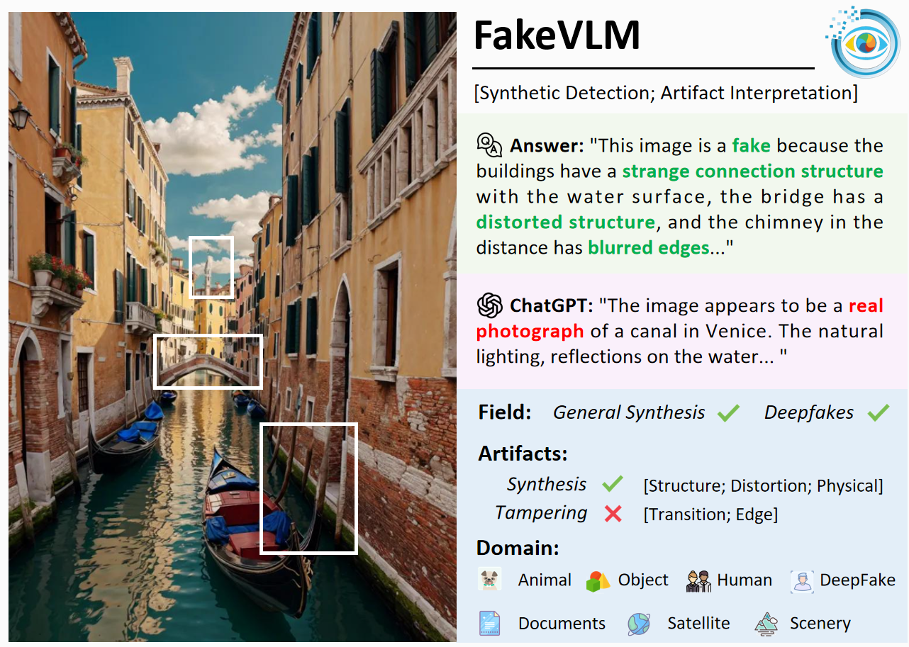
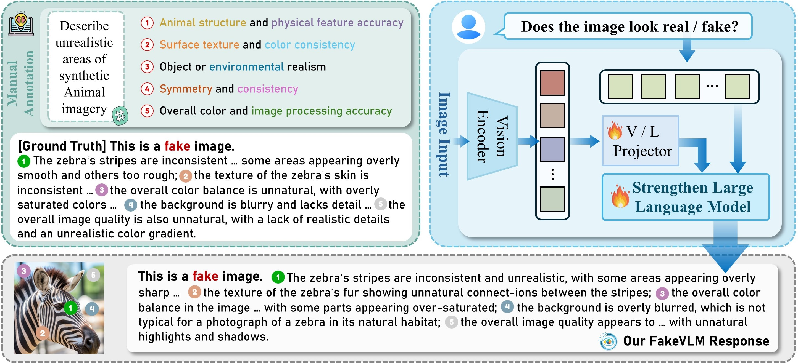
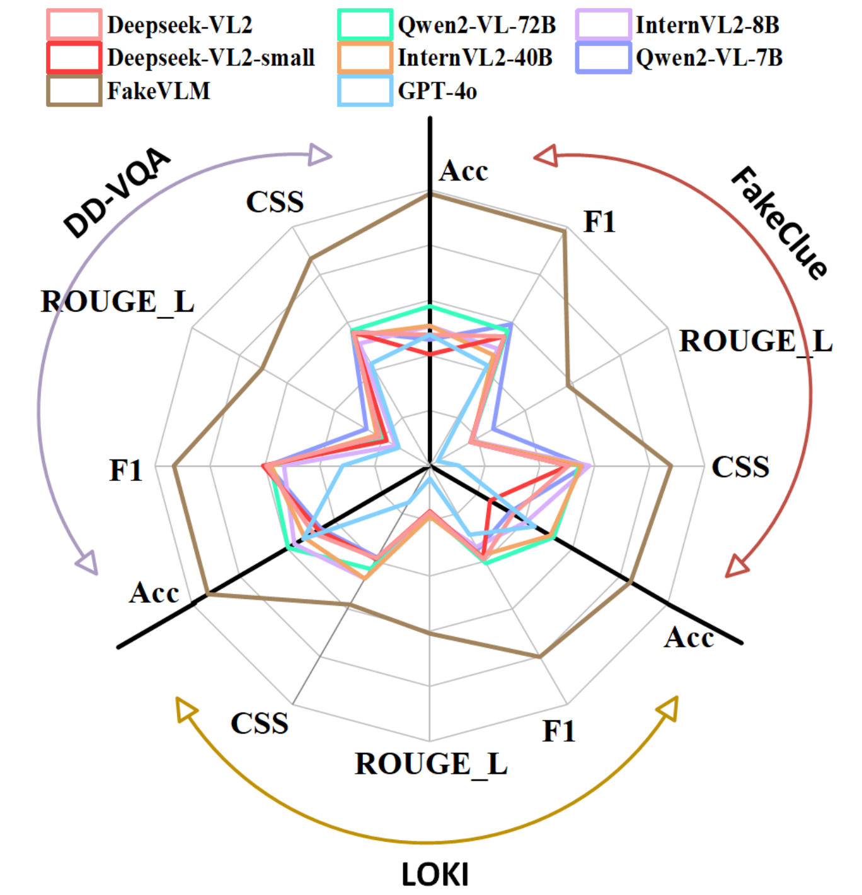

<div align="center">

<h3> Spot the Fake: Large Multimodal Model-Based Synthetic Image Detection with Artifact Explanation </h3> 

</div>

##  FakeVLM Overview

With the rapid advancement of Artificial Intelligence Generated Content (AIGC) technologies, synthetic images have become increasingly prevalent in everyday life, posing new challenges for authenticity assessment and detection. Despite the effectiveness of existing methods in evaluating image authenticity and locating forgeries, these approaches often lack human interpretability and do not fully address the growing complexity of synthetic data. To tackle these challenges, we introduce FakeVLM, a specialized large multimodal model designed for both general synthetic image and DeepFake detection tasks. FakeVLM not only excels in distinguishing real from fake images but also provides clear, natural language explanations for image artifacts, enhancing interpretability. Additionally, we present FakeClue, a comprehensive dataset containing over 100,000 images across seven categories, annotated with fine-grained artifact clues in natural language. FakeVLM demonstrates performance comparable to expert models while eliminating the need for additional classifiers, making it a robust solution for synthetic data detection. Extensive evaluations across multiple datasets confirm the superiority of FakeVLM in both authenticity classification and artifact explanation tasks, setting a new benchmark for synthetic image detection. The code and dataset will be released soon.



##  Contributions

- We propose FakeVLM,  a multimodal large model designed for both general synthetic and deepfake image detection tasks. It excels at distinguishing real from fake images while also providing excellent interpretability for artifact details in synthetic images.
- We introduce the FakeClue dataset, which includes a rich variety of image categories and fine-grained artifact annotations in natural language.
- Our method has been extensively evaluated on multiple datasets, achieving outstanding performance in both synthetic detection and abnormal artifact explanation tasks.

## 🛠️ Installation
Please clone our repository and change to that folder
```bash
git clone git@github.com:lingcco/FakeVLM.git
cd FakeVLM
```

Our model is based on the llava environment. Please follow the steps below to configure the environment.
```bash
conda create -n fakevlm python=3.9 -y
conda activate fakevlm
pip install --upgrade pip  
pip install -e .
pip install -e ".[train]"
pip install flash-attn --no-build-isolation
```

## 📦 Dataset
The directory containing the images should have the following structure:
```
playground       
└──data
    └──train
        |--doc
            |--fake
            |--real
        .
        .
        .
        |--satellite
    └──test
        .
        .
        .    
```


## 📌 Usage


## 📊 Results


<!-- ## 📝 Citation
If you find our work useful in your research, please consider citing our paper:
```bibtex
@inproceedings{fakevlm, -->